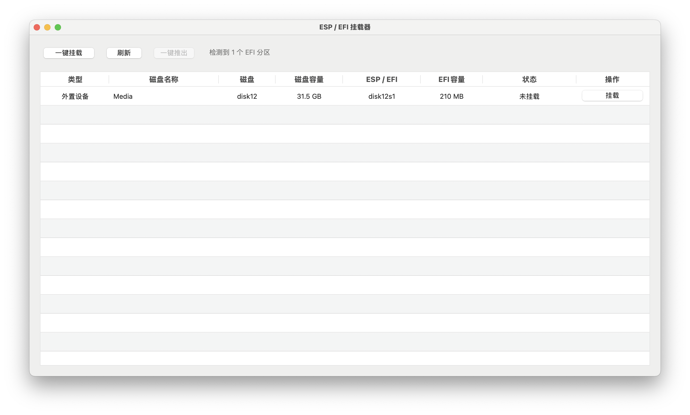
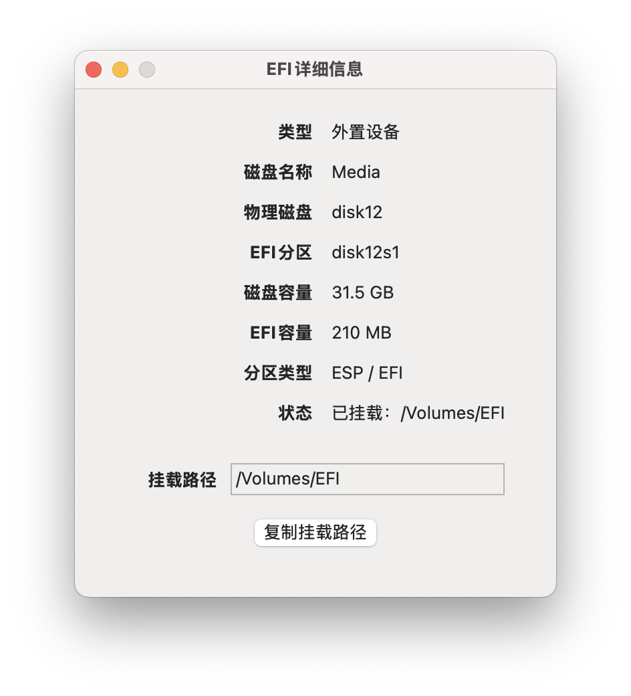
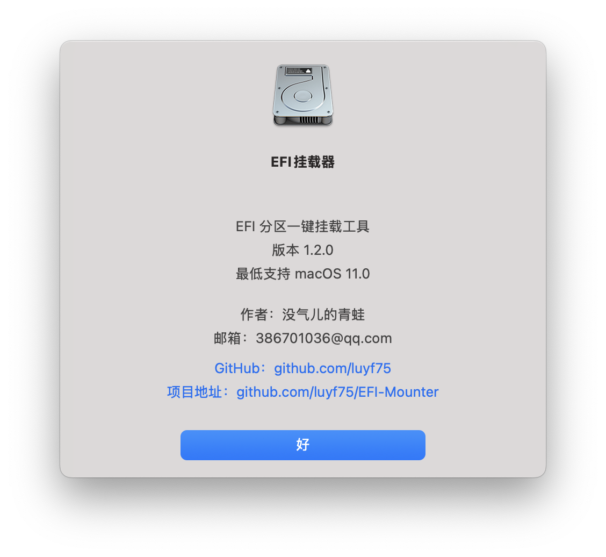

# EFI挂载器

一个简洁、直观的 macOS EFI / ESP 分区管理工具。

EFI挂载器用于扫描、识别、挂载和卸载 Mac 上的 EFI / ESP 分区，支持内置硬盘和外置存储设备。

无需手动输入 Terminal 命令，即可通过图形界面完成 EFI 分区管理。

---

## ✨ 主要功能

### 💾 磁盘与 EFI 分区识别

- 自动扫描当前 Mac 上的磁盘和分区
- 自动识别 EFI / ESP 分区
- 区分内置硬盘和外置设备
- 显示磁盘名称
- 显示物理磁盘
- 显示 EFI 分区
- 显示磁盘总容量
- 显示 EFI 分区容量
- 显示分区类型
- 显示 EFI 当前状态
- 显示 EFI 挂载路径

---

### 🔧 一键挂载 EFI

通过图形界面直接挂载 EFI 分区。

支持：

- 内置硬盘 EFI
- 外置 USB EFI
- 移动硬盘 EFI
- 可识别的 EFI / ESP 分区

挂载成功后，可以直接访问 EFI 分区中的文件。

---

### ⏏️ EFI 卸载

支持直接卸载已经挂载的 EFI 分区。

卸载后会自动更新当前磁盘状态。

---

### 🔄 自动刷新

当 EFI 分区发生挂载或卸载状态变化时，程序会自动更新磁盘列表。

同时提供手动刷新功能。

无需退出程序即可重新扫描当前磁盘状态。

---

### 📊 EFI 详细信息

双击磁盘列表中的项目，可以打开独立的 EFI 详细信息窗口。

详细显示：

- 类型
- 磁盘名称
- 物理磁盘
- EFI 分区
- 磁盘容量
- EFI 容量
- 分区类型
- 当前状态
- 挂载路径

---

### 📋 一键复制挂载路径

EFI 挂载成功后，可以直接复制 EFI 挂载路径。

方便在 Finder、Terminal 或其他工具中快速访问 EFI 分区。

---

### ℹ️ 关于 EFI挂载器

应用内提供独立的「关于 EFI挂载器」窗口。

包含：

- 软件名称
- 当前版本
- 最低支持系统
- 作者
- 联系邮箱
- GitHub 地址
- 项目地址

GitHub 和项目地址支持直接点击访问。

---

# 📸 软件截图

### 🖥️ 软件首页



### 📊 EFI详细信息



### ℹ️ 关于 EFI挂载器



---

# 🖥️ 系统要求

最低支持：

**macOS 11.0 Big Sur**

支持：

- macOS 11.0+
- Apple Silicon Mac
- Intel Mac

---

# 🧩 Universal 通用版本

v1.2.0 正式版采用 Universal 通用架构。

同一个应用同时支持：

| 平台 | 架构 |
|---|---|
| Apple Silicon Mac | arm64 |
| Intel Mac | x86_64 |

无需针对不同处理器下载不同版本。

---

# 📦 下载

最新正式版：

**EFI挂载器 v1.2.0**

请前往 GitHub Releases 下载最新 DMG 安装包。

安装包：

`EFI挂载器-v1.2.0.dmg`

---

# 🚀 安装

下载 DMG 后双击打开。

将：

`EFI挂载器.app`

拖入：

`Applications`

即可完成安装。

DMG 使用标准 macOS 拖拽安装方式。

---

# 🔐 macOS 权限说明

EFI 分区属于系统磁盘管理相关资源。

根据 macOS 版本以及当前磁盘状态，系统可能要求用户进行管理员授权或授予相应的文件访问权限。

这是 macOS 自身的安全机制。

如果系统出现权限提示，请按照 macOS 的提示进行授权。

---

# 🛠️ 从源码编译

## 环境要求

- macOS 11.0+
- Xcode
- Swift
- AppKit
- XcodeGen（如果需要重新生成 Xcode 项目）

## 使用 Xcode

打开：

`EFI挂载器.xcodeproj`

选择：

`EFI挂载器`

Scheme，然后进行 Build。

## 使用命令行

```bash
xcodebuild \
-project "EFI挂载器.xcodeproj" \
-scheme "EFI挂载器" \
-configuration Release \
build
```

---

# 📁 项目结构

```text
EFI-Mounter
├── EFI挂载器.xcodeproj
├── EFI挂载器
│   ├── AppDelegate.swift
│   ├── EFIInfo.swift
│   ├── EFIManager.swift
│   ├── ViewController.swift
│   ├── main.swift
│   ├── Info.plist
│   └── Assets.xcassets
├── Screenshots
├── project.yml
├── README.md
├── LICENSE
└── .gitignore
```

---

# 🔍 EFI / ESP 工作方式

EFI挂载器通过 macOS 系统提供的磁盘管理工具获取磁盘和分区信息，并识别 EFI / ESP 分区。

程序不会修改 EFI 分区中的文件内容。

挂载 EFI 后，用户可以自行使用 Finder 或其他工具管理 EFI 文件。

---

# ⚠️ 使用提示

EFI 分区通常包含操作系统启动相关文件。

修改 EFI 中的文件前，建议先做好备份。

尤其是在 Hackintosh / OpenCore 环境中，建议在修改 EFI 前保留一个可正常启动的 EFI 备份。

---

# 📄 License

本项目采用：

**Apache License 2.0**

详细授权内容请参阅项目中的 [`LICENSE`](LICENSE) 文件。

---

# 👤 作者

**没气儿的青蛙**

邮箱：

`386701036@qq.com`

GitHub：

`https://github.com/luyf75`

项目：

`https://github.com/luyf75/EFI-Mounter`

---

# ⭐ 项目

如果这个项目对你有帮助，欢迎 Star ⭐

欢迎提交 Issue、反馈问题以及提出改进建议。

---

## Release

### v1.2.0

首个正式发布版本。

主要包含：

- EFI / ESP 自动识别
- 内置 / 外置磁盘识别
- 一键挂载
- EFI 卸载
- 自动刷新
- 手动刷新
- 磁盘容量显示
- EFI 详细信息
- 双击查看详细信息
- 一键复制挂载路径
- macOS 原生应用图标
- 关于窗口
- GitHub 项目链接
- Universal arm64 + x86_64
- 标准 DMG 拖拽安装

最低支持：

**macOS 11.0**

---

**EFI挂载器 v1.2.0**

macOS EFI / ESP 分区管理工具。
