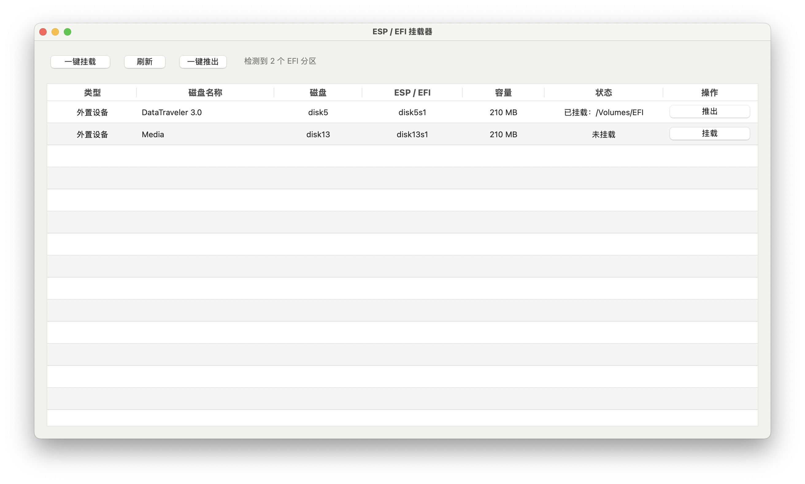

# EFI 挂载器 v1.1.1

一个用于 macOS 的 EFI / ESP 分区管理工具。

## 软件截图

## 当前版本

**v1.1.1** — 当前正式发布版本，支持 Intel Mac（x86_64）和 Apple Silicon Mac（arm64）。
## 当前功能

- 扫描 EFI / ESP 分区
- 区分内置硬盘和外置设备
- 显示磁盘名称、磁盘标识符、EFI 分区、容量和挂载状态
- 单个 EFI 挂载
- 单个 EFI 推出
- 一键挂载
- 一键推出
- 挂载时使用 macOS 管理员授权
- 推出 EFI 时无需管理员授权
- 根据 EFI 状态自动启用或禁用操作按钮

## 下载

最新正式版本：**v1.1.1**

请前往 GitHub Releases 下载 **EFI-Mounter-v1.1.1.dmg**。

下载 DMG 后打开，将 `EFI挂载器.app` 拖入“应用程序”文件夹即可。
## 系统要求

- macOS
- Xcode
- Swift / AppKit

## 编译

使用 Xcode 打开 `EFI挂载器.xcodeproj`，选择 `EFI挂载器` Scheme，然后 Build。

也可以使用命令行：

    xcodebuild -project "EFI挂载器.xcodeproj" -scheme "EFI挂载器" -configuration Debug build

## EFI / ESP

程序通过 macOS 的 `diskutil` 获取磁盘和分区信息，并识别 Content 为 EFI 的分区作为 EFI / ESP 分区。

Apple Silicon Mac 与传统 Intel / Windows / 黑苹果电脑的启动结构不同，部分 Apple Silicon Mac 内部磁盘不存在传统的 EFI System Partition。

## 开发计划

### macOS

- [x] EFI / ESP 扫描
- [x] 内置 / 外置磁盘识别
- [x] EFI 挂载
- [x] EFI 推出
- [x] 一键挂载
- [x] 一键推出
- [x] 基础 GUI

### Windows

- [ ] EFI / ESP 扫描
- [ ] EFI 挂载
- [ ] EFI 推出
- [ ] Windows UAC 权限处理

### Linux

- [ ] EFI / ESP 扫描
- [ ] EFI 挂载
- [ ] EFI 推出
- [ ] Linux 权限处理

## 项目状态

macOS 版本已经可以正常扫描、挂载和推出 EFI / ESP 分区。

Windows 和 Linux 版本尚未实现。

## License

本项目采用 Apache License 2.0 开源。
